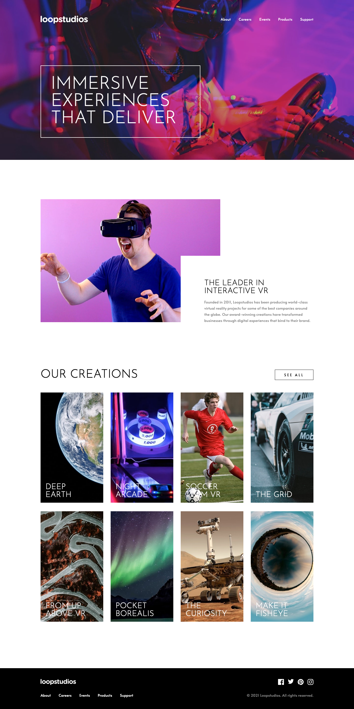

# Loopstudios landing page solution

This is a solution to the [Loopstudios landing page challenge on Frontend Mentor](https://www.frontendmentor.io/challenges/loopstudios-landing-page-N88J5Onjw). Frontend Mentor challenges help you improve your coding skills by building realistic projects.

## About the Project

The **"Loopstudios Landing Page"** is a Frontend Mentor challenge designed to showcase a creative agency's portfolio.

This project was developed using **React**, initialized with `create-react-app`, providing a component-based structure that simplifies the management of the landing page's various sections.

**CSS** was used for basic styling, while **Scss** took over for the styling of the rest of the components, offering a more sophisticated approach to design with its advanced features.

## Preview and Links

<b>Open Preview</b>

 

 

| [Live Demo URL](https://ionstici.github.io/loopstudios-landing-page) | [Frontend Mentor](https://www.frontendmentor.io/solutions/loopstudios-landing-page-QUgw2NFgHr) |
| -------------------------------------------------------------------- | ---------------------------------------------------------------------------------------------- |

## Acknowledgements

Thanks to **Frontend Mentor** for the challenge. You should give it a try if you're looking to improve your frontend coding skills.
